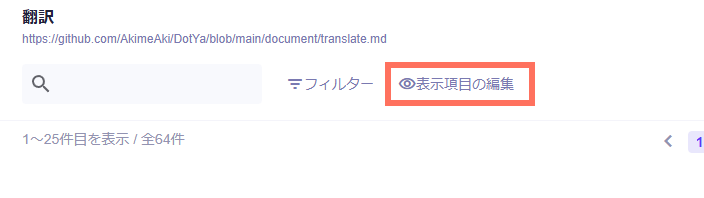
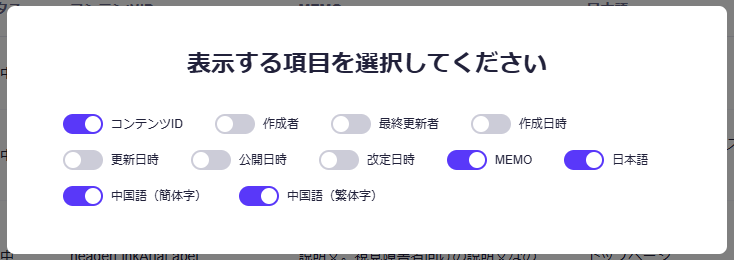
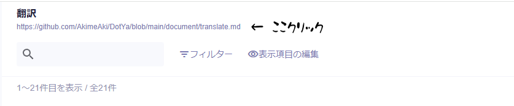

## サイト上の翻訳の仕様

| 対応言語         | 言語コード | パス                         |
| ---------------- | ---------- | ---------------------------- |
| 日本語           | ja         | https://pixel.gives/\*       |
| 中国語（簡体字） | zh-cn      | https://pixel.gives/zh-cn/\* |
| 中国語（繁体字） | zh-tw      | https://pixel.gives/zh-tw/\* |

-   翻訳が完了していない言語は日本語を表示
    -   英語とか増えたらここは英語になるかもしれない
-   中国語は、簡体字が翻訳されてなければ、繁体字、それも翻訳されてなければ日本語を表示（逆も同様）

## 言語選択仕組み

1. Cookieに言語が記録されているか確認
2. Cookieになければ端末の言語を確認
3. 端末の言語が分からなければパスから言語を確認
4. 上記の順序で確認できた言語をCookieに保存
5. 確認できた言語とパスが一致していなければリダイレクト、言語が分からなければ何もしない

## microCMS使い方

### microCMS上の「👁️表示項目の編集」おすすめ

一覧が見やすい

### ドキュメントはここからいつでも見れる

## 入力欄説明

### MEMO

メモです。

### それぞれの言語

日本語を元にそれぞれの言語で翻訳文を記載

#### 注意事項

-   最後に空行を入れないほうが身のため
-   不要な装飾を勝手しないようにすると、世界が平和になる（太字など）
    -   日本語にも装飾がある場合のみ装飾を使用する

## あんまり気にしなくて良いかもしれない説明

### コンテンツIDの仕様

-   `_`が無いものはほぼ全ページに適用されるもの
-   `_`があるものは`_`を`/`に変換してページが記載されている
-   `id`がついてるものは大体可変の値が入る（本当にidっていうパスのときもあるのかもしれない）

#### 例

-   `_○○○`: トップページ（`https://pixel.gives/`）で使用される文章
-   `×××_△△△_□□□`: `https://pixel.gives/×××/△△△`で使用される文章
-   `▽▽▽`: ページ全体で仕様される文章
-   `◇◇◇_id_◎◎◎`: `https://pixel.gives/◇◇◇/image1`や`https://pixel.gives/◇◇◇/image2`もしくは`https://pixel.gives/◇◇◇/id`で使用される文章
